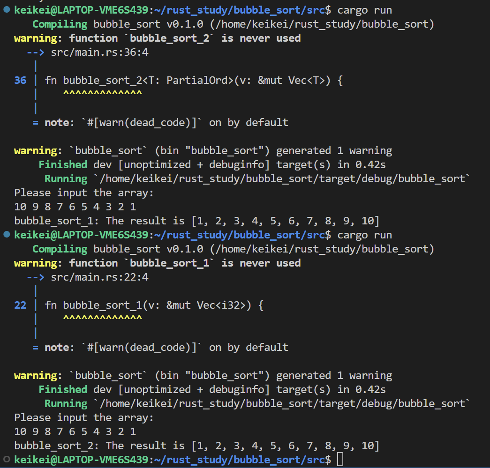

# Substrate第三课作业

使用Rust语言写一个冒泡排序的算法
* 基础要求：固定类型（比如i32）的数组排序
* 提高部分：能够使用template和PartialOrd实现对任意类型的排序


运行截图：


代码：

``` rust
use std::io;

fn main() {
    // 在一行读取多个整数
    println!("Please input the array:");
    let mut input = String::new();
    io::stdin()
        .read_line(&mut input)
        .unwrap();
    let mut v: Vec<i32> = input.trim()
        .split(' ')
        .map(|x| x.parse().unwrap())
        .collect();
    // 调用函数
    // bubble_sort_1(&mut v);
    // println!("bubble_sort_1: The result is {:?}", v);
    bubble_sort_2(&mut v);
    println!("bubble_sort_2: The result is {:?}", v);
}

// 基础的冒泡排序
fn bubble_sort_1(v: &mut Vec<i32>) {
    let number = v.len();
    for _i in 0..number {
        for j in 0..number-1 {
            if v[j] > v[j + 1] {
                let tmp = v[j];
                v[j] = v[j + 1];
                v[j + 1] = tmp;
            }
        }
    }
}

// 使用PartialOrd的冒泡排序
fn bubble_sort_2<T: PartialOrd>(v: &mut Vec<T>) {

    let size = v.len();
    if size <= 1 {
        return;
    }

    for i in 0..(size-1) {
        // 判断是否交换过
        let mut swapped = false;
        for j in 1..(size - i) {
            // 比较相邻的元素 如果第一个比第二个大，就交换他们两个。
            if v[j - 1]  > v[j] {
                // 切片交换两个元素 
                v.swap(j - 1, j);
                swapped = true;
            }
        }
        // 如果未发生交换，说明已经排好序，跳出后续的冒泡
        if !swapped {
            break;
        }
    }
}
```